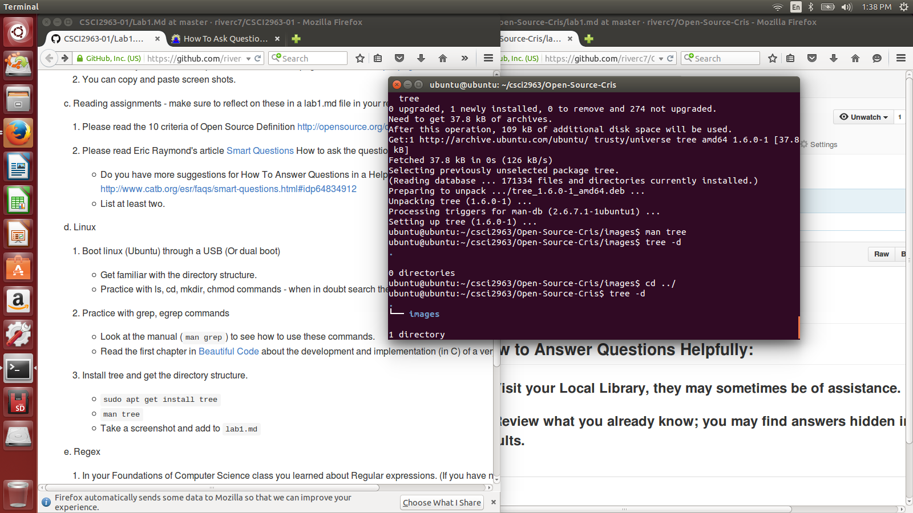
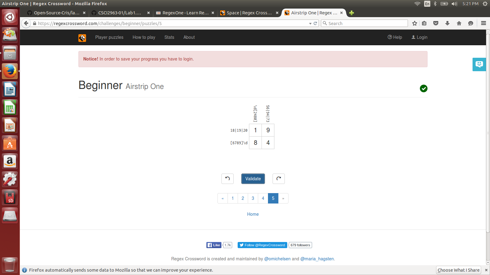
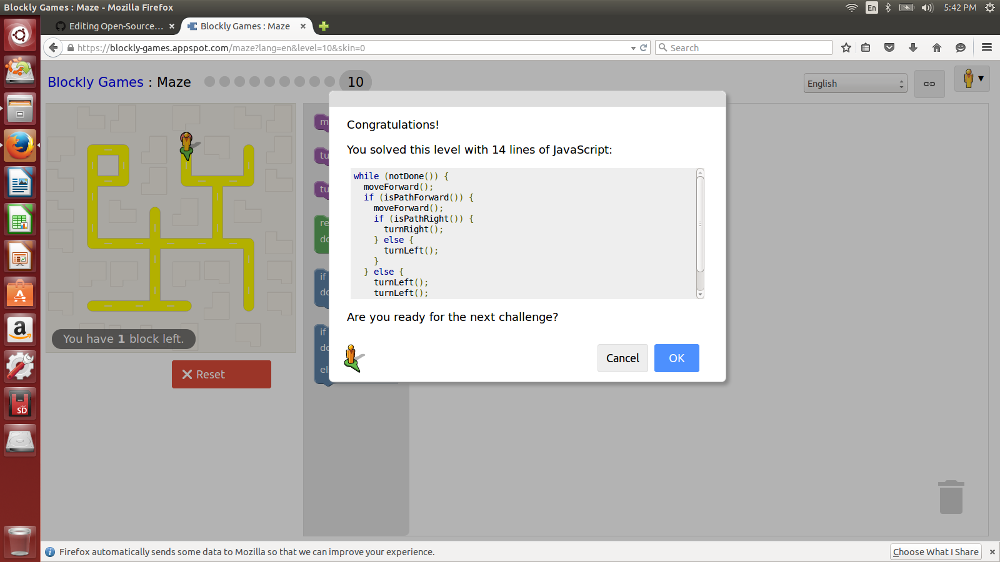

#Lab 1

##How to Answer Questions Helpfully:
###1) Visit your Local Library, they may sometimes be of assistance. 
###2) Review what you already know; you may find answers hidden in past results.

##Linux Tree usage:

##Regex Problems:

##Blooky:

Currently looking into Automatic Differentiation with my work study. Im wrote up code for different mathematical situations for them. 
